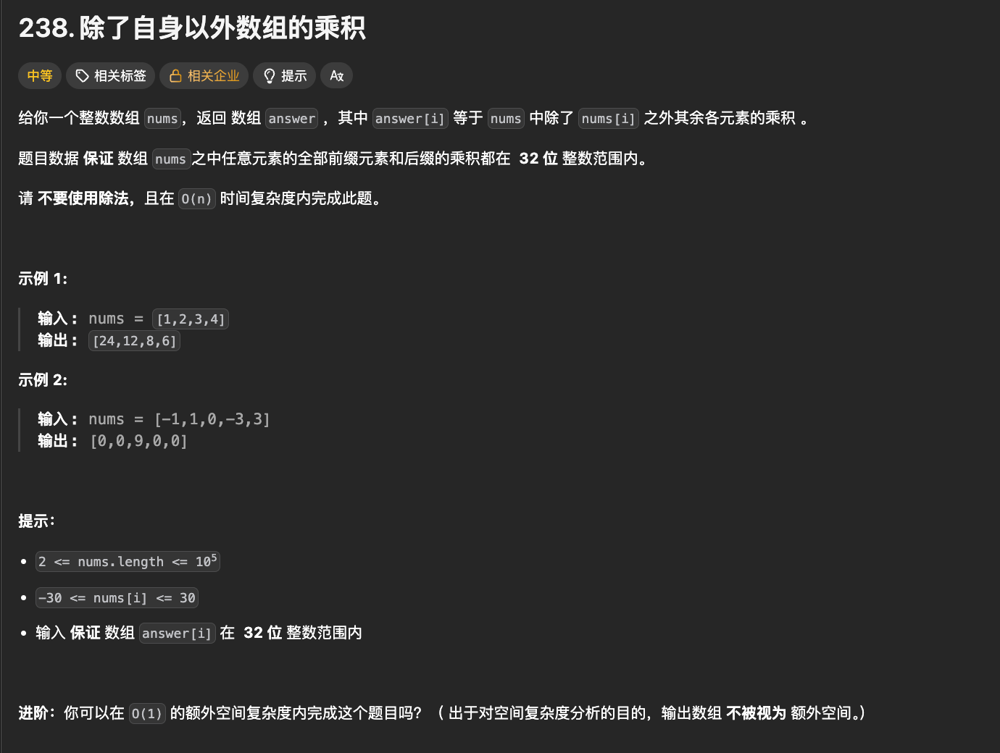

# 238. 除自身以外数组的乘积（Product of Array Except Self）

- 难度：中等
- 标签：数组、前缀积、后缀积
- LeetCode：238
- 高频面试题：⭐⭐⭐⭐⭐

---

# 一、题目描述




```python
class Solution:
    def productExceptSelf(self, nums: List[int]) -> List[int]:
        # 变量存储数组长度
        n = len(nums)
        # 给answer数组初始化
        answer = [1] * n
        # 值存储perfix前缀积
        prefix = 1

        # 开始循环
        for i in range(n):
            answer[i] = prefix
            prefix *= nums[i] #表示下一个位置，的前缀积，也就是可以理解为下一个位置的除他自身以外的前缀的积

        # 开始计算后缀积：
        suffix = 1
        # range (start, stop, step) (stop的位置实际取不到，取到前一位，-1的前一位即表示0)
        for i in range(n - 1, -1, -1):
            # 前缀积 x 后缀积 的 答案
            answer[i] *= suffix
            suffix *= nums[i] # 表示下一个位置，的后缀积，也就是可以理解为下一个位置的除他自身以外的后缀的积
        # 返回整个数组
        return answer
        
```

给定一个整数数组：

```python
nums
```

返回数组：

```python
answer
```

其中：

```python
answer[i]
=
nums 中除 nums[i] 之外
所有元素的乘积
```

---

## 要求

### 不能使用除法

```text
❌ 不能先求总乘积再除 nums[i]
```

---

### 时间复杂度

```text
必须 O(n)
```

---

### 进阶要求

```text
额外空间复杂度 O(1)

（返回数组不算额外空间）
```

---

# 二、题目本质

例如：

```python
nums = [1,2,3,4]
```

---

对于：

```python
nums[0]
```

答案应该是：

```python
2 × 3 × 4

= 24
```

---

对于：

```python
nums[1]
```

答案应该是：

```python
1 × 3 × 4

= 12
```

---

结果：

```python
[24,12,8,6]
```

---

# 三、暴力解法

最容易想到：

```python
对于每个位置

重新遍历整个数组
```

---

例如：

```python
for i in range(n):

    product = 1

    for j in range(n):

        if i != j:
            product *= nums[j]
```

---

时间复杂度：

```text
O(n²)
```

---

LeetCode 会超时。

---

# 四、核心思想

观察：

对于位置 i：

```python
answer[i]
```

其实等于：

```text
左边所有数字乘积

×

右边所有数字乘积
```

---

例如：

```python
nums = [1,2,3,4]
```

对于：

```python
nums[2] = 3
```

---

左边：

```python
1 × 2 = 2
```

---

右边：

```python
4
```

---

答案：

```python
2 × 4

= 8
```

---

因此：

```text
答案 = 前缀积 × 后缀积
```

---

# 五、前缀积（Prefix Product）

定义：

```python
prefix[i]
```

表示：

```text
i 左边所有数字的乘积
```

---

例如：

```python
nums = [1,2,3,4]
```

---

前缀积：

```python
prefix = [1,1,2,6]
```

---

解释：

```python
prefix[0] = 1

prefix[1] = 1

prefix[2] = 1×2

prefix[3] = 1×2×3
```

---

# 六、后缀积（Suffix Product）

定义：

```python
suffix[i]
```

表示：

```text
i 右边所有数字乘积
```

---

例如：

```python
nums = [1,2,3,4]
```

---

后缀积：

```python
suffix = [24,12,4,1]
```

---

解释：

```python
suffix[0] = 2×3×4

suffix[1] = 3×4

suffix[2] = 4

suffix[3] = 1
```

---

# 七、状态关系

对于任意位置：

```python
answer[i]
=
prefix[i] * suffix[i]
```

例如：

```python
i = 2
```

---

前缀积：

```python
2
```

---

后缀积：

```python
4
```

---

结果：

```python
2 × 4

= 8
```

---

# 八、方法一：前缀积 + 后缀积数组

---

## LeetCode代码

```python
class Solution:
    def productExceptSelf(self, nums: List[int]) -> List[int]:

        n = len(nums)

        prefix = [1] * n
        suffix = [1] * n

        for i in range(1, n):
            prefix[i] = prefix[i - 1] * nums[i - 1]

        for i in range(n - 2, -1, -1):
            suffix[i] = suffix[i + 1] * nums[i + 1]

        answer = [1] * n

        for i in range(n):
            answer[i] = prefix[i] * suffix[i]

        return answer
```

---

# 九、优化思路（面试重点）

观察：

```python
answer[i]
=
prefix[i] × suffix[i]
```

---

实际上：

```text
没必要保存整个 suffix 数组
```

---

可以：

```python
answer
```

先存前缀积。

然后：

```python
从右向左遍历
```

使用一个变量：

```python
right_product
```

动态维护后缀积。

---

这样：

```text
额外空间 O(1)
```

---

# 十、LeetCode核心代码模式（最优解）

这是面试最常写的版本。

```python
class Solution:
    def productExceptSelf(self, nums: List[int]) -> List[int]:

        n = len(nums)

        answer = [1] * n

        prefix = 1

        for i in range(n):

            answer[i] = prefix

            prefix *= nums[i] 

        suffix = 1

        for i in range(n - 1, -1, -1):

            answer[i] *= suffix

            suffix *= nums[i]

        return answer
```

---

# 十一、执行过程详解

<mark>我们需要注意理解，这里的answer中存储的每个位置的 出去他自身的 （前或后）缀积！<mark/>

输入：

```python
nums = [1,2,3,4]
```

---

初始化：

```python
answer = [1,1,1,1]
```

---

## 第一遍遍历（构建前缀积）

---

### i = 0

```python
answer[0] = 1
prefix = 1 × 1 = 1
```

结果：

```python
[1,1,1,1]
```

---

### i = 1

```python
answer[1] = 1

prefix = 1 × 2
       = 2
```

结果：

```python
[1,1,1,1]
```

---

### i = 2

```python
answer[2] = 2

prefix = 2 × 3
       = 6
```

结果：

```python
[1,1,2,1]
```

---

### i = 3

```python
answer[3] = 6
```

结果：

```python
[1,1,2,6]
```

---

此时：

```python
answer
=
prefix数组
```

---

# 第二遍遍历（乘后缀积）

初始化：

```python
suffix = 1
```

---

### i = 3

```python
answer[3] *= 1

= 6
```

更新：

```python
suffix *= 4

= 4
```

---

### i = 2

```python
answer[2] *= 4

= 8
```

更新：

```python
suffix *= 3

= 12
```

---

### i = 1

```python
answer[1] *= 12

= 12
```

更新：

```python
suffix *= 2

= 24
```

---

### i = 0

```python
answer[0] *= 24

= 24
```

---

最终：

```python
[24,12,8,6]
```

---

# 十二、涉及到的函数讲解

---

## 1. len()

作用：

```text
获取数组长度
```

---

示例：

```python
nums = [1,2,3]

len(nums)
```

结果：

```python
3
```

---

## 2. range()

作用：

```text
生成整数序列
```

---

示例：

```python
for i in range(5):
    print(i)
```

输出：

```python
0
1
2
3
4
```

---

本题：

```python
range(n - 1, -1, -1)
```

表示：

```text
从右往左遍历

这个是 Python 里面最经典的倒序遍历写法之一。
先记住 range 的三个参数
range(start, stop, step)

含义：
从 start 开始
每次加 step
到达 stop 前停止（不包含 stop） 
（此处中间stop = -1 表示数组的最后一位，也就是倒着开始循环到正数第一位）

常见疑惑：
你把 range(n-1, -1, -1) 中的第二个 -1
理解成了：nums[-1]
（数组最后一个元素）
但实际上：这里的 -1 不是数组下标，而是 range 的 stop 参数。

最容易记忆的方法
想得到：最后一个下标 → 第一个下标
即：
4
3
2
1
0

就写：range(n-1, -1, -1)
因为：stop 永远不包含
所以要想访问到：0
就必须把 stop 写成：0 再往前一个位置
也就是：-1
```

---

例如：

```python
range(3, -1, -1)
```

得到：

```python
3
2
1
0
```

---

## 3. *=

作用：

```text
乘法赋值
```

---

示例：

```python
x = 5

x *= 3
```

等价于：

```python
x = x * 3
```

结果：

```python
15
```

---

本题：

```python
answer[i] *= suffix

*= 的真正含义这一句：
answer[i] *= suffix 等价于：

answer[i] = answer[i] * suffix

意思：左边乘积×右边乘积
得到：除了自己以外所有元素的乘积
```

表示：

```python
前缀积 × 后缀积
```

---

# 十三、ACM模式写法

适用于：

```text
牛客
华为OD
腾讯机试
阿里机试
字节机试
PAT
蓝桥杯
Codeforces
```

---

## ACM代码

输入：

```text
1 2 3 4
```

输出：

```text
24 12 8 6
```

---

```python
def solve():

    nums = list(map(int, input().split()))

    n = len(nums)

    answer = [1] * n

    prefix = 1

    for i in range(n):

        answer[i] = prefix

        prefix *= nums[i]

    suffix = 1

    for i in range(n - 1, -1, -1):

        answer[i] *= suffix

        suffix *= nums[i]

    print(*answer)


solve()
```

---

# 十四、为什么不能用除法？

很多人会想到：

```python
total = 1

for num in nums:
    total *= num

answer[i] = total // nums[i]
```

---

看起来：

```text
O(n)
```

---

但题目明确要求：

```text
不能使用除法
```

---

原因：

```python
nums = [1,2,0,4]
```

---

总乘积：

```python
0
```

---

出现：

```python
0 / 0
```

问题。

因此面试官要求：

```text
必须使用前缀积 + 后缀积
```

---

# 十五、复杂度分析

---

## 最优解

时间复杂度：

```text
O(n)
```

---

空间复杂度：

```text
O(1)
```

（返回数组不算额外空间）

---

# 十六、面试考点总结

---

## 必会结论1

对于位置 i：

```python
answer[i]
=
左边乘积 × 右边乘积
```

---

## 必会结论2

前缀积：

```python
prefix
```

表示：

```text
当前位置左边所有元素乘积
```

---

## 必会结论3

后缀积：

```python
suffix
```

表示：

```text
当前位置右边所有元素乘积
```

---

## 必会结论4

最优解：

```python
answer先保存前缀积

再从右往左乘后缀积
```

---

## 必会结论5

复杂度：

```text
时间 O(n)

空间 O(1)
```

---

# 十七、LeetCode Hot100归类

本题属于：

```text
数组（Array）
```

同时也是：

```text
前缀和思想的变种
```

准确来说：

```text
Prefix Product + Suffix Product
```

经典面试题。

推荐一起刷：

```text
53. 最大子数组和

238. 除自身以外数组的乘积

560. 和为 K 的子数组

724. 寻找数组中心下标

303. 区域和检索
```

---

# 十八、一句话记忆模板（面试秒杀版）

```text
answer[i]

=

左边所有数乘积

×

右边所有数乘积

先保存前缀积

再从右往左乘后缀积

即可 O(n) 时间、O(1) 空间解决。
```